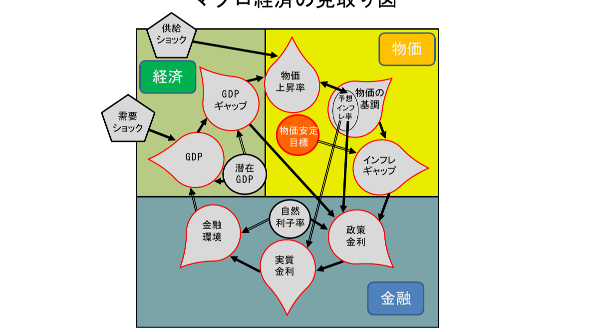

# market-macro-analysis

日本銀行の金融政策判断フレームワーク「**マクロ経済の見取り図**」に基づき、経済・物価・金融の現状をモニタリングするツール。

---

## 「マクロ経済の見取り図」とは

日本銀行が利上げ・利下げを判断するとき、「今の経済はどんな状態か」を整理するために使っている3つの視点のことです。



> 出典：日本銀行副総裁 氷見野良三「最近の金融経済情勢と金融政策運営」（2026年3月2日）図表１

3つのブロックはお互いに影響し合っています。たとえば「金利を下げる（金融）→ 企業が投資しやすくなる（経済）→ モノの需要が増えて物価が上がる（物価）」という連鎖です。

日銀はこの3つを総合的に見て、「目標の物価上昇率 2% が安定的に続きそうか」を判断します。

### 3つのブロックで何を見るか

| ブロック | 代表的な指標 | 何を知りたいか |
|---------|------------|--------------|
| 金融 | 政策金利・実質金利・自然利子率 | 今の金融環境は経済にとって「緩め」か「引き締め」か |
| 経済 | GDPギャップ・GDP成長率 | モノ・サービスへの需要が供給を上回っているか |
| 物価 | コアCPI・刈込平均インフレ率 | 物価上昇が本当に定着しつつあるか |

---

## このツールで確認できること

### 「見取り図」構成要素と実装状況

日銀の見取り図が想定する指標すべてを取得・表示できるわけではありません。
データの公開状況・取得コストに応じて、一部は代替指標や定数で近似しています。

| 指標 | ブロック | 実装状況 | データソース | 備考 |
|------|---------|---------|------------|------|
| コアCPI（生鮮食品を除く・前年比） | 物価 | ✅ チャートあり | 総務省 e-Stat | |
| 政策金利（無担保コールレート翌日物・月平均） | 金融 | ✅ チャートあり | 日銀時系列統計DB | |
| 需給ギャップ（GDPギャップ） | 経済 | ✅ チャートあり | 内閣府月例経済報告 | |
| 予想インフレ率（BEI） | 金融 | ✅ チャートあり | stock-marketdata.com（日本相互証券ベース） | 週次実行のたびに蓄積 |
| 実質金利 | 金融 | ⚠️ 算出値のみ（チャートなし） | 政策金利 − 予想インフレ率で算出 | 政策判断チェッカーで使用 |
| 自然利子率 | 金融 | ⚠️ 定数 0.5% で近似 | − | 本来は Laubach-Williams 法等で推計 |
| 名目賃金（所定内給与前年比） | 物価 | ❌ 断念 | 厚労省 毎月勤労統計 | API のデータ形式問題で断念 |
| 刈込平均インフレ率 | 物価 | ❌ 未実装 | 日銀 | 次フェーズ候補 |
| トレンドインフレ率（BVAR推計） | 物価 | ❌ 未実装 | 日銀ワーキングペーパー | 次フェーズ候補 |
| GDP成長率・潜在GDP成長率 | 経済 | ❌ 未実装 | 内閣府 | 次フェーズ候補 |
| 短観加重平均DI | 経済 | ❌ 未実装 | 日銀短観 | 次フェーズ候補 |

---

### BEI（期待インフレ率）について

#### BEI とは

**BEI（ブレーク・イーブン・インフレ率）** は市場参加者が将来の物価上昇を何%と見込んでいるかを示す市場ベースの指標です。国債の名目利回りから物価連動国債の実質利回りを引いた値で計算されます。

このツールでは **[stock-marketdata.com](https://stock-marketdata.com/bei.html)** が公開している日次 BEI データ（日本相互証券ベース）をスクレイピングで取得しています。

| 項目 | 内容 |
|------|------|
| データソース | stock-marketdata.com（日本相互証券ベースで算出） |
| 更新頻度 | 毎営業日（直近12営業日分が公開） |
| DB への蓄積 | `fetch_data` 実行のたびに最新値を upsert（冪等） |
| 時系列の育ち方 | 週次実行を続けることで日次データが積み上がる |

#### 時系列が少ない理由

BEI の過去データ（2004年〜）は以下の理由で一括取得できません：

- 日本相互証券は直近12営業日分のみを公開している
- 日銀 API でも物価連動国債利回りの系列は提供対象外であることを調査で確認

そのため、運用開始直後はプロット数が少なく、**週次実行を継続することで時系列が蓄積されていく**設計です。

#### 自然利子率 0.5% の根拠

**自然利子率**とは、経済を過熱も冷却もしない「中立的な」実質金利水準のことです。本来は Laubach-Williams 法などの統計モデルで推計しますが、その計算には複数の経済変数と高度な時系列分析が必要です。

このツールでは日銀リサーチ論文での推計レンジ（0〜1%程度）の中央値として **0.5% を定数** で使っています。

---

### 実質金利の読み方

日銀が金融政策の「緩め・引き締め」を判断するとき、**名目の政策金利ではなく実質金利**を見ます。

```
実質金利 ＝ 政策金利 − 予想インフレ率

例）政策金利 0.5%、予想インフレ率 2.0% のとき
    実質金利 ＝ 0.5% − 2.0% ＝ −1.5%
```

この実質金利を **自然利子率（0.5%）と比べる** ことで緩和度合いを判定します。

```
実質金利（−1.5%）< 自然利子率（0.5%）→ 緩和的な金融環境
実質金利（0.5%）= 自然利子率（0.5%）→ 中立（経済に影響ゼロ）
実質金利（1.5%）> 自然利子率（0.5%）→ 引き締め的な金融環境
```

名目金利だけ見ると「0.5% は低い」と思えますが、物価が 2% 上がっていれば実質的にはマイナス金利と同じ緩和効果があります。

---

### 1. コアCPI（物価ブロック）

**コアCPI**（消費者物価指数・生鮮食品を除く総合）の前年同月比。
生鮮食品は天候で価格が大きく変わるため除いており、「基調的な物価の動き」を見る指標として使われます。

- 日銀の物価目標は **2%**
- 2% を超えているか、それが一時的でなく定着しているかが焦点

### 2. 政策金利（金融ブロック）

**無担保コールレート翌日物**の月平均値。
銀行同士が翌日返済条件でお金を貸し借りするときの金利で、日銀が誘導目標を設定しています。いわゆる「日銀の政策金利」です。

- 0% 付近 → 超緩和的な金融環境
- 引き上げ → 経済・物価が十分に回復したと日銀が判断したサイン

### 3. GDPギャップ（経済ブロック）

**需給ギャップ**とも呼ばれます。「実際のGDP（需要）」と「経済が無理なく出せる最大のGDP（潜在GDP・供給力）」の差をパーセントで表したものです。

- **プラス** → 需要が供給を上回っている → 物価が上がりやすい
- **ゼロ近傍** → 需給バランスがとれている
- **マイナス** → 需要が足りない → 物価が下がりやすい・デフレ圧力

---

## 出力サンプル

### サマリーレポート（`report/summary.md`）

| 指標 | 最新値 | 前回比 | 評価 |
|------|--------|--------|------|
| コアCPI（前年比） [2025-01] | 3.2% | ▲ 0.20 | 🟡 |
| 政策金利（月平均） [2025-01] | 0.500% | ▲ 0.03 | 🟢 |
| 需給ギャップ [2024-Q4] | 0.1% | ▲ 0.40 | 🟢 |

🟢 目標レンジ内 ／ 🟡 やや外れ ／ 🔴 要注意

### BEI（期待インフレ率）チャート（`report/png/expected_inflation_chart.png`）

BEI（ブレーク・イーブン・インフレ率）の日次時系列グラフ。BEI は「国債の名目利回り − 物価連動国債の実質利回り」で算出され、市場参加者が将来の物価上昇を何 % と見込んでいるかを表す市場ベースの期待インフレ率です。

データソースは [stock-marketdata.com](https://stock-marketdata.com/bei.html)（日本相互証券ベース）。`fetch_data` 実行のたびに直近12営業日分を upsert で蓄積するため、週次実行を続けるほど時系列が長くなります。

- **2% ライン（灰色破線）**: 日銀の物価目標
- **1.5% ライン（黄色点線）**: 政策判断チェッカーの充足閾値（BEI > 1.5% で「市場が目標達成を織り込んでいる」と判定）

### インフレギャップチャート（`report/png/inflation_gap_chart.png`）

**インフレギャップ**（コアCPI − BEI月次平均）の時系列棒グラフです。

- **プラス（赤）**: 実際の物価上昇が市場の期待を上回っている → 追加利上げ圧力が高い
- **マイナス（青）**: 実際の物価上昇が市場の期待を下回っている → 緩和継続の余地あり

BEI は日次データのため、月次平均を算出してコアCPI（月次）と突合しています。BEI 蓄積が進むほど時系列が長くなります。

### 統合チャート（`report/png/combined_chart.png`）

コアCPI・政策金利・GDPギャップ・BEI（期待インフレ率）の4指標を縦に並べた PNG を生成します。

---

## クイックスタート

```bash
uv sync --extra dev

# 1. データ取得（estat-api.toml が必要）
uv run python main.py fetch_data all

# 2. チャート生成
uv run python main.py make_chart all

# 3. サマリーレポート生成
uv run python main.py make_report all
```

---

## 用語集

| 用語 | 意味 |
|------|------|
| **政策金利** | 日銀が誘導目標を設定する短期金利。現在は無担保コールレート翌日物 |
| **コアCPI** | 生鮮食品を除く消費者物価指数。基調的な物価動向の代表指標 |
| **GDPギャップ（需給ギャップ）** | 実際のGDPと潜在GDPの差。需要超過でプラス、需要不足でマイナス |
| **潜在GDP** | 経済が無理なく持続できる最大の生産水準 |
| **実質金利** | 政策金利 − 予想インフレ率。名目金利より経済への影響を正確に表す |
| **自然利子率** | 経済を過熱も冷却もしない「中立的な」実質金利水準 |
| **刈込平均インフレ率** | 価格変動の大きい上下各10%の品目を除いたCPIの平均。物価の「芯」を見る |
| **BEI（ブレーク・イーブン・インフレ率）** | 市場が織り込む将来の期待インフレ率 |
| **MPM（金融政策決定会合）** | 日銀が政策金利を決定する会合。年8回開催 |

---

## ドキュメント

| ドキュメント | 内容 |
|------------|------|
| [利用方法ガイド](docs/guide/usage.md) | セットアップ・コマンド・出力ファイルの詳細 |
| [仕様書](docs/spec/macro_analysis_tool_spec.md) | システム設計・フレームワーク定義 |

## テスト

```bash
uv run pytest tests/unit/
```
