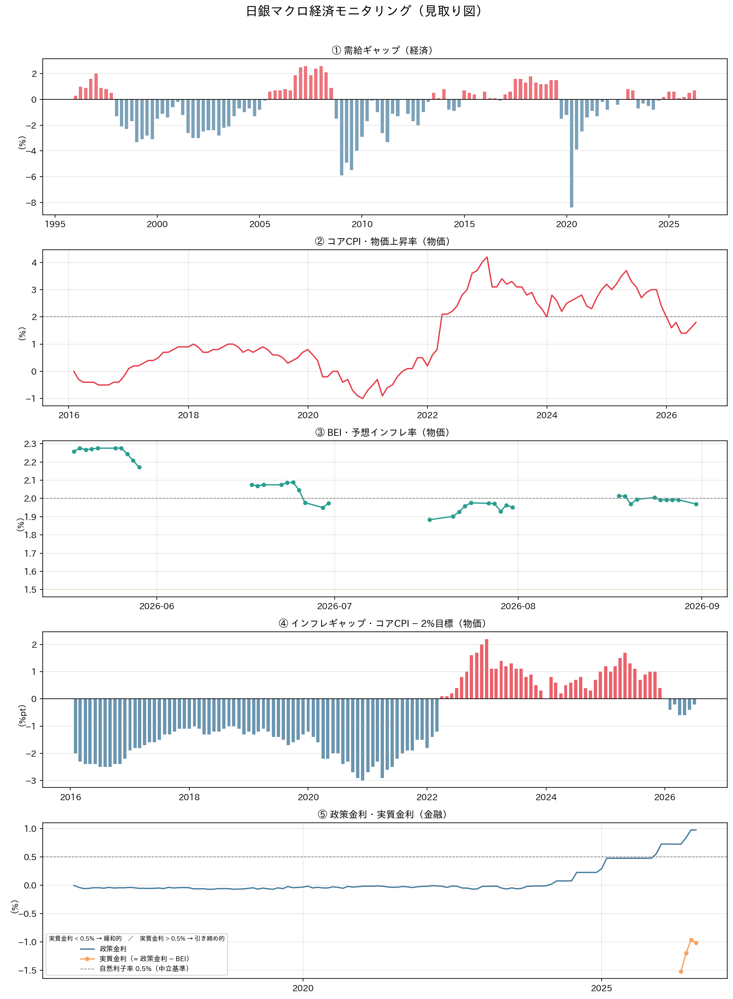
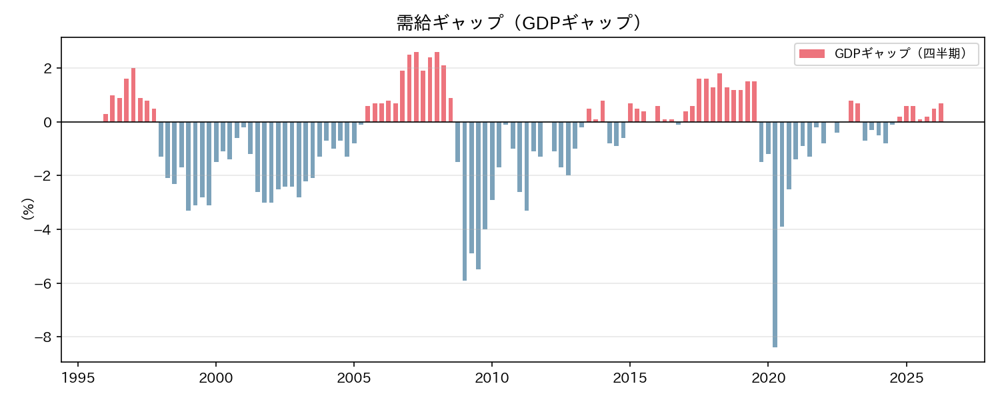
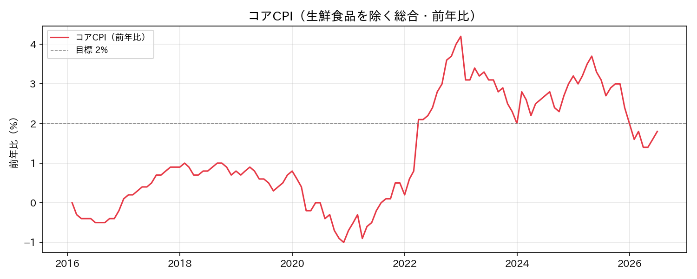
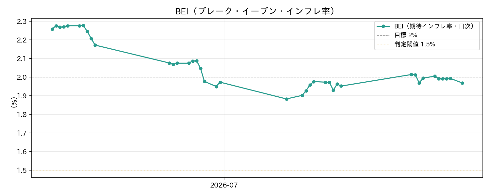
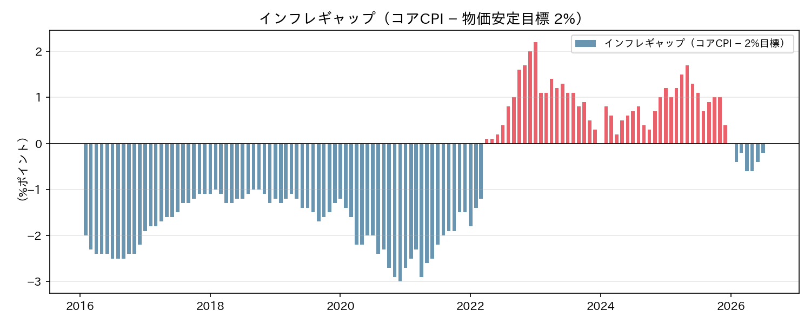
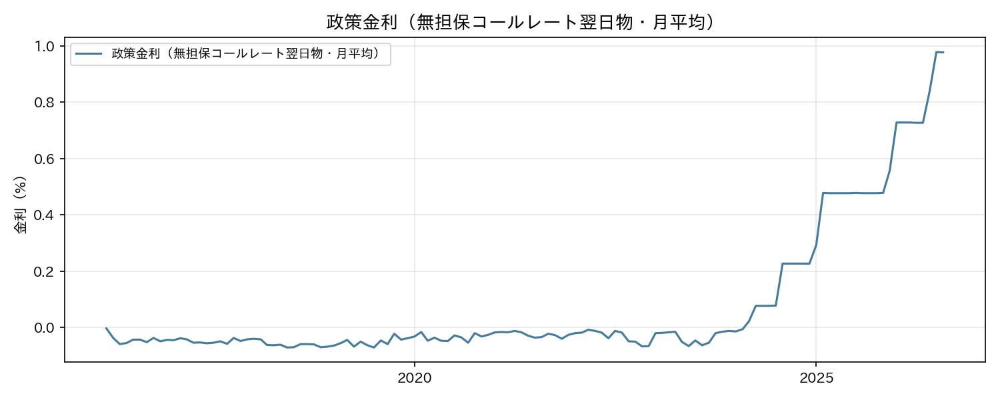

# マクロ経済考察レポート（2026-06-13）

> 生成日時: 2026-06-13

---

## エグゼクティブサマリー

**「市場の楽観と実体経済の乖離」が現在の最大のテーマ**。日経225は3ヶ月で24%近い急騰を演じ、BEI（期待インフレ率）は2.17%と物価目標を超えているにもかかわらず、コアCPIは2026年1月の2.0%をピークに4月には1.4%まで急落している。市場は「物価目標の達成」を先読みしているが、実際の消費者物価はむしろ目標から遠ざかる動きを見せている。

政策金利0.727%はテイラールールが示す適正水準（1.85%）を1.12%ポイント下回っており、実質金利は-1.45%と大幅に緩和的な環境が続く。円安（160円台）と株高という外部環境は表面上は「日銀正常化への順風」に見えるが、物価の実態はより複雑なシグナルを発している。次回MPMに向け、日銀が「一時的な物価低下」と判断するか、「利上げペースの見直し」を迫られるかが焦点となる。

---

## 総合モニタリングチャート（見取り図）

5指標を「日銀の見取り図」（経済→物価→金融）の時計回り順に並べた俯瞰図。



---

## 1. 国内経済・物価指標の現状

### 1-1. 指標サマリー

| 指標 | 最新値 | 前回値 | 変化 | 評価 |
|------|--------|--------|------|------|
| コアCPI（前年比）[2026-04] | 1.4% | 1.8% | ▼ 0.4%pt | 🔴 目標未達・急落中 |
| 政策金利（月平均）[2026-05] | 0.727% | 0.728% | → 横ばい | 🟢 段階的正常化中 |
| 需給ギャップ [2026-Q1] | +0.5% | +0.1% | ▲ 0.4%pt | 🟢 需要超過に改善 |
| BEI（期待インフレ率）[2026-05-29] | 2.17% | 2.21% | ▼ 0.04%pt | 🟢 目標超え継続 |
| 実質金利（政策金利 − BEI） | −1.45% | − | − | 🔴 大幅緩和的 |

🟢 良好・目標方向　／　🟡 やや外れ　／　🔴 要注意・目標から乖離

---

### 1-2. テイラールール：適正政策金利の試算

テイラールールは「中央銀行が本来設定すべき政策金利水準」を客観的に試算するための標準的な経済学的手法です。

```
【テイラールール】
適正金利 ＝ 均衡実質金利 ＋ 目標インフレ率 ＋ 0.5 × 需給ギャップ ＋ 1.5 × インフレギャップ

均衡実質金利（自然利子率）: 0.5%（日銀リサーチ推計レンジ中央値）
目標インフレ率: 2.0%
需給ギャップ: +0.5%
インフレギャップ（コアCPI − 2%）: 1.4% − 2.0% ＝ −0.6%

適正金利 ＝ 0.5 ＋ 2.0 ＋ 0.5 × 0.5 ＋ 1.5 × (−0.6)
         ＝ 0.5 ＋ 2.0 ＋ 0.25 − 0.9
         ＝ 1.85%
```

| 項目 | 値 |
|------|---|
| テイラールール適正金利 | **1.85%** |
| 現在の政策金利 | 0.727% |
| 乖離（過剰緩和幅） | **−1.12%pt** |

現在の政策金利はテイラールール比で **1.12%ポイント低すぎる**状態。これは日本経済の実力に比べて金融緩和が過剰であることを示唆する。ただしインフレギャップがマイナスである限り、適正金利は押し下げられ続けるため、コアCPIの回復なしに急激な利上げは正当化されにくい。

---

### 1-3. 指標別詳細考察

#### ① 需給ギャップ（経済ブロック）



2026年Q1に+0.5%へ改善しており、需要面からの物価押し上げ圧力は存在している。Q3の0.0%→Q4の+0.1%→Q1の+0.5%と**改善トレンドが続いている**点は物価の先行きにとってポジティブだ。ただしGDPギャップは「経済全体の需給」を示す指標であり、消費者物価への波及には通常3〜6ヶ月のラグがある。現在のCPIの落ち込みに需給ギャップの改善が追いついてくるのは2026年後半と見られる。

---

#### ② コアCPI・物価上昇率（物価ブロック）



2025年11月の3.0%をピークに急落が続いており、2026年4月は1.4%まで低下した。特に注目すべきは **2026年1月に2.0%の目標水準に到達しながら、翌月以降に反落した**点だ。

| 月 | コアCPI（前年比） |
|----|----------------|
| 2025-11 | 3.0% ← 直近ピーク |
| 2025-12 | 2.4% |
| 2026-01 | 2.0% ← 目標到達 |
| 2026-02 | 1.6% |
| 2026-03 | 1.8% |
| 2026-04 | 1.4% ← 直近（急落） |

下落要因として考えられるのは、①エネルギー価格の前年比ベース効果の剥落、②政府の物価高対策（電気・ガス補助金等）の継続的な影響、③食品価格の落ち着きなどが挙げられる。

---

#### ③ BEI（期待インフレ率）と④ インフレギャップ（物価ブロック）



BEIは2.17%と、日銀の物価安定目標（2%）を上回っている。コアCPIが1.4%に落ち込んでいるにもかかわらず、市場参加者は「将来的に2%を超えるインフレが定着する」と見ていることを示す。

**コアCPIとBEIの乖離：0.77%ポイント**

この乖離が現在最も注目すべきシグナルだ。
- 市場の楽観が正しければ → コアCPIは今後反発し、利上げ継続が正当化される
- 市場の楽観が過剰であれば → BEIが低下方向に修正され、日銀の政策見直しが迫られる

---



インフレギャップ（コアCPI − 2%目標）は現在 **−0.6%ポイント**。マイナス（青棒）は「物価上昇が目標に届いていない」状態を示す。2025年末〜2026年初にかけてゼロ近傍まで接近したが、足元は再びマイナス方向に転じている。グラフを見ると2022〜2023年の急上昇→2024年以降の落ち着きという大局的なトレンドが読み取れる。

---

#### ⑤ 政策金利・実質金利・自然利子率（金融ブロック）



政策金利は2025年12月の利上げ（0.557%→0.727%）以降、横ばいが続いている。

```
実質金利 ＝ 政策金利（0.727%）− BEI（2.172%）＝ −1.45%
自然利子率（中立基準）＝ 0.5%
緩和超過幅 ＝ −1.45% − 0.5% ＝ −1.95%ポイント
```

実質金利が自然利子率を約2%ポイント下回っており、金融環境は**大幅に緩和的**。名目金利が0.727%でも、物価期待を差し引くと企業・家計が「実質的にはほぼタダで資金調達できる」状態を意味する。日銀が「利上げをしても緩和姿勢は維持」と説明する根拠がここにある。

---

## 2. 外部要因・市場動向

### 2-1. 為替（USDJPY）

| 期間 | 水準 |
|------|------|
| 現在（2026-06-13） | **160.18 円/ドル** |
| 1ヶ月前（2026-05-13頃） | 158.38 円/ドル |
| 3ヶ月前（2026-03中旬） | 157.24 円/ドル |
| 3ヶ月高値 | 160.53 円/ドル |
| 3ヶ月安値 | 152.78 円/ドル |
| 1ヶ月変化率 | **+1.14%（円安方向）** |
| 3ヶ月変化率 | **+1.87%（円安方向）** |

円は3ヶ月にわたって緩やかに円安方向へ進行し、現在は **160円台の高止まり**が続いている。この水準は輸入物価の上昇を通じてエネルギー・食品価格を押し上げる方向に働く。しかし足元のコアCPIが低下していることを踏まえると、その物価押し上げ効果は実態よりも弱い可能性がある。

**日米金利差との関係**：

| 指標 | 値 |
|------|---|
| 米10年債利回り（2026-06-13） | 4.487% |
| 日本政策金利 | 0.727% |
| 日米金利差 | **3.76%ポイント** |

米10年債利回りが4.49%に対して日本の政策金利は0.73%と、日米金利差は3.76%ポイントと依然として大きい。この金利差が円安圧力の根本要因であり、日銀が利上げペースを緩めれば円安が定着しやすい構造になっている。「円安→輸入物価上昇→CPI押し上げ」のルートは現在も働いているが、その効果がBEIほどコアCPIに反映されていないことが課題だ。

### 2-2. 株式市場（日経225）

| 期間 | 水準 |
|------|------|
| 現在（2026-06-12） | **66,020 円** |
| 1ヶ月前（2026-05-13頃） | 62,654 円 |
| 3ヶ月前（2026-03中旬） | 53,376 円 |
| 3ヶ月高値 | 68,402 円 |
| 3ヶ月安値 | 51,064 円 |
| 1ヶ月変化率 | **+5.37%（強い上昇）** |
| 3ヶ月変化率 | **+23.69%（急騰）** |

日経225は3ヶ月で24%近い急騰を記録し、歴史的な水準に迫っている。この株高は①円安による輸出企業の業績改善期待、②米国株高に連動したグローバルリスクオン、③金融緩和継続への期待感が背景にある。

ただし、6月に入って68,402円の高値をつけた後、やや調整局面（66,000円台）に入っており、短期的な過熱感も台頭している。株高が「企業活動の活性化→雇用改善→賃金上昇→物価上昇」という好循環の入り口であるとすれば、日銀の「賃金・物価の好循環」の物語を支持する材料となる。しかしコアCPIが実際には低下中であることを踏まえると、「株高が先走りしており、実体経済が追いついていない」リスクも存在する。

---

## 3. 総合考察（金融政策への含意）

### 3-1. 現状の総括：「2つの乖離」に要注意

現在の日本のマクロ経済環境には、注目すべき **2つの乖離** がある。

**乖離①：コアCPI（1.4%）とBEI（2.17%）の差 → 0.77%ポイント**

市場参加者は「物価目標の達成・超過」を期待しているが、実際の消費者物価は目標を0.6ポイント下回っている。この乖離が縮小する（CPI反発）か拡大する（BEI低下）かが今後のシナリオを分岐させる。

**乖離②：テイラールール適正金利（1.85%）と現在の政策金利（0.73%）の差 → 1.12%ポイント**

需要と物価を考慮したルールベースでは現在の政策金利は約1.85%が適正とされるが、実際には0.73%に留まっている。これは「日銀がいかに慎重に正常化を進めているか」を示すと同時に、「利上げ余地が大きく残されている」ことも意味する。

### 3-2. 次回MPMに向けたシナリオ分析

**シナリオA：利上げ継続（確率: 中）**

GDPギャップ+0.5%、BEI2.17%、日経225の急騰という「好循環の証拠」が揃っており、次回MPMで追加利上げを決定するシナリオ。コアCPIの低下は「一時的な前年比ベース効果」と判断し、今後の回復を見越した判断となる。

**シナリオB：様子見（確率: 高）**

コアCPIが1.4%と目標を大きく下回るなか、急いで利上げする根拠が乏しいとして現行水準（0.727%）を維持するシナリオ。「基調的な物価上昇の定着を確認する」という日銀の従来姿勢に沿った判断。実質金利は依然大幅マイナスであり、緩和的環境は継続する。

**シナリオC：利上げ停止・見直し（確率: 低）**

コアCPIの下落が続き、内需の弱さが確認された場合、「2026年内の追加利上げはない」との市場コンセンサスが形成されるシナリオ。緩和環境の長期化で円安がさらに定着するリスクを伴う。

### 3-3. リスクシナリオ

**上振れリスク（物価加速・利上げ前倒し）**

- 円安が155円を超える水準で定着 → 輸入インフレが再燃
- 2026年春闘以降の賃上げ効果がサービス価格に波及 → コアCPI反発
- BEIの実体への収束 → 期待と実績のギャップ縮小
- → 日銀は利上げペースを加速し、年内に政策金利が1.0%に近づく可能性

**下振れリスク（物価低迷・正常化頓挫）**

- コアCPIの低下が継続し、1%台前半が定着
- 米国景気後退 → ドル安 → 急激な円高 → 輸入物価下落 → CPI押し下げ
- 株価急落 → 企業マインド悪化 → 賃上げ抑制 → 物価への好循環断絶
- → 日銀は利上げを停止し、最悪のケースでは緩和方向への転換が議論される

---

## 4. まとめ：3つのウォッチポイント

| # | 注目ポイント | 意味 |
|---|------------|------|
| 1 | **5月・6月コアCPI** | 4月の1.4%急落が継続か反発か。これが次回MPMの最大の判断材料 |
| 2 | **BEIの動向** | 2%を超えた期待インフレが維持されるか。低下すればシナリオBからCへの移行サイン |
| 3 | **USDJPY 160円台の定着度** | 円安が輸入物価を通じてCPIを反発させるか。160円超えが続くほど物価回帰圧力が高まる |

---

> ※ 市場データ（USDJPY・日経225・米国債利回り）は Yahoo Finance（yfinance）経由で取得した 2026-06-13 時点の値です。
> テイラールール計算における自然利子率は日銀リサーチ論文の推計レンジ中央値（0.5%）を使用しています。
> チャート画像は `docs/report/images/` に格納済み（生成元: `uv run python main.py make_chart all`）。
